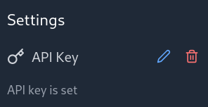

# Prefix Manager

A modern web application for managing and using custom prefixes with ChatGPT conversations.


## ✨ Features

- 🔐 **User Authentication**
    - Local authentication system
    - Secure password handling
    - User profile management

- 🎨 **Modern UI/UX**
    - Clean and intuitive interface
    - Responsive design
    - Dark mode support
    - Smooth animations and transitions

- 📝 **Prefix Management**
    - Create custom prefixes
    - Categorize prefixes
    - Color-code prefixes
    - Drag-and-drop reordering
    - Usage tracking

- 💬 **ChatGPT Integration**
    - Direct conversations with ChatGPT
    - Custom prefix prepending
    - Real-time typewriter effect
    - Message history
    - Copy message functionality

- 🔍 **Search & Filter**
    - Quick prefix search
    - Category filtering
    - Sort by usage

## 🚀 Getting Started

1. **Clone and Install**
   ```bash
   git clone git@github.com:DanihStephane/prefix-manager-chatGPT.git
   cd prefix-manager-chatGPT
   npm install
   ```

2. **Set up Environment Variables**

   
   

4. **Run Development Server**
   ```bash
   npm run dev
   ```

## 🛠️ Tech Stack

- **Frontend Framework**: React with TypeScript
- **Styling**: TailwindCSS
- **State Management**: Zustand
- **Routing**: React Router
- **Icons**: Lucide React
- **Drag & Drop**: DND Kit
- **Build Tool**: Vite

## 🏗️ Project Structure

```
src/
├── components/         # Reusable UI components
│   ├── Auth/          # Authentication related components
│   ├── Chat/          # Chat interface components
│   └── ...
├── pages/             # Page components
├── store/             # Zustand store definitions
├── types/             # TypeScript type definitions
└── services/          # API and service integrations
```

## 🎯 Core Features Explained

### Authentication System
- Local storage based authentication
- Secure password handling
- Protected routes
- User session management

### Prefix Management
- Create, edit, and delete prefixes
- Custom colors and categories
- Usage tracking and statistics
- Drag-and-drop reordering

### Chat Interface
- Real-time conversation with ChatGPT
- Message history
- Typewriter effect for responses
- Copy message functionality

### Theme Support
- System-based theme detection
- Manual theme toggle
- Persistent theme preference

## 🤝 Contributing

Contributions are welcome! Please feel free to submit a Pull Request.

## 📄 License

This project is licensed under the MIT License - see the [LICENSE](LICENSE) file for details.
